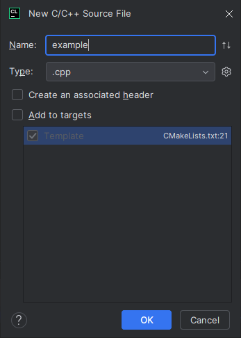

# Controls

F1 - Toggle Manual Camera
F3 - Toggle HUD
F5 - Reload Render System
F11 - Toggle Fullscreen
P - Play Animation
ESC / Left Alt - Release Mouse

# Project Setup (For CLion)

### Software you needppppp
1. CLion (and VS 2022 on Windows)
2. vcpkg and the vcpkg CLion plugin
3. cmake

Note: Installing all the project dependencies might take over an hour.

### VCPkg Setup

Simply run `vcpkg install` in the project root.  
You should probably set the `VCPKG_ROOT` environment variable tho.

### CLion Configuration

Select View | Tool Windows | Vcpkg from the main menu to open the Vcpkg tool window.

Here you can see all the vcpkg dependencies. CLion will tell you "This vcpkg instance is not used in any CMake profile.", but this is wrong, and you can ignore it.
But note that you might have to restart CLion once or twice to get the first CMake project reload to work.

When creating new files, make sure you have "Add to targets" checked off!
In newer CMake version, you can use GLOB_RECURSE to reliably add all source files automatically.

### Attributions

City model: CC BY 4.0
by https://sketchfab.com/abhayexe

Ambiance sound - https://soundimage.org/sfx-urban-ambience/
"STREET AMBIENCE 2" by Eric Matyas www.soundimage.org